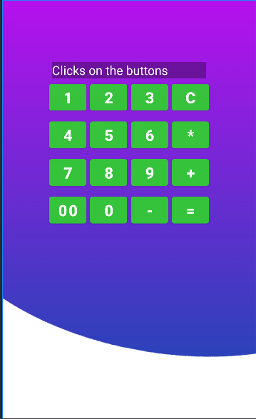

<h2 align="center">  МИНИСТЕРСТВО НАУКИ И ВЫСШЕГО ОБРАЗОВАНИЯ РОССИЙСКОЙ ФЕДЕРАЦИИ ФЕДЕРАЛЬНОЕ ГОСУДАРСТВЕННОЕ БЮДЖЕТНОЕ ОБРАЗОВАТЕЛЬНОЕ УЧРЕЖДЕНИЕ ВЫСШЕГО ОБРАЗОВАНИЯ «САХАЛИНСКИЙ ГОСУДАРСТВЕННЫЙ УНИВЕРСИТЕТ» </h2>
<div align="center">
<h3>Институт естественных наук и техносферной безопасности
<br>
Кафедра информатики
<br>
Половников Владислав Олегович</h3>

<br>
<h3>Дополнительное задание №1
<br>
“Калькулятор”
<br>
01.03.02 Прикладная математика и информатика</h3>
<br>
<br>
<br>
<br>
<br>
<br>
<br>
<br>
<br>
<br>
<br>
<br>
<br>
<br>
<h3 align="right">Научный руководитель
<br>
Соболев Евгений Игоревич
</h3>

<h3 align="center">Южно-Сахалинск
<br>
2023г.
</h3>
<hr>
</div>
<p>
Kotlin - это высокоэффективный современный язык программирования, разработанный компанией JetBrains. Он имеет очень чёткий и лаконичный синтаксис, что делает ваш код лёгким для чтения. Kotlin широко используется во всём мире, и его популярность среди разработчиков постоянно растёт. Многие разработчики, использующие Kotlin, отмечают, что это делает их работу быстрее и увлекательнее.
</p>

<h3 align="center">Задание</h3>

Сделать простой калькулятор


<h1 align="center">Решение</h2>



<h2 align="center">MainActivity</h2>

```kotlin
package com.example.calculator

import androidx.appcompat.app.AppCompatActivity
import android.os.Bundle
import android.widget.Button
import android.widget.TextView
import org.w3c.dom.Text
import kotlin.math.min


class MainActivity : AppCompatActivity() {

    private lateinit var oneButton: Button
    private lateinit var twoButton: Button
    private lateinit var threeButton: Button
    private lateinit var fourButton: Button
    private lateinit var fiveButton: Button
    private lateinit var sixButton: Button
    private lateinit var sevenButton: Button
    private lateinit var eightButton: Button
    private lateinit var nineButton: Button
    private lateinit var clearButton: Button
    private lateinit var addButton: Button
    private lateinit var plusButton: Button
    private lateinit var minusButton: Button
    private lateinit var zerozeroButton: Button
    private lateinit var zeroButton: Button
    private lateinit var resultButton: Button
    private lateinit var viewResult: TextView


    override fun onCreate(savedInstanceState: Bundle?) {
        super.onCreate(savedInstanceState)
        setContentView(R.layout.activity_main)

        var blockedbuttons: Boolean = true

        oneButton = findViewById(R.id.button_one)
        twoButton = findViewById(R.id.button_two)
        threeButton = findViewById(R.id.button_three)
        fourButton = findViewById(R.id.button_four)
        fiveButton = findViewById(R.id.button_five)
        sixButton = findViewById(R.id.button_six)
        sevenButton = findViewById(R.id.button_seven)
        eightButton = findViewById(R.id.button_eight)
        nineButton = findViewById(R.id.button_nine)
        clearButton = findViewById(R.id.button_clear)
        addButton = findViewById(R.id.button_add)
        plusButton = findViewById(R.id.button_plus)
        minusButton = findViewById(R.id.button_minus)
        zerozeroButton = findViewById(R.id.button_zerozero)
        zeroButton = findViewById(R.id.button_zero)
        resultButton = findViewById(R.id.button_result)
        viewResult = findViewById(R.id.view_result)

        oneButton.setOnClickListener{
            viewResult.setText(viewResult.text.toString() + "1")
            blockedbuttons = false
        }

        twoButton.setOnClickListener{
            viewResult.setText(viewResult.text.toString() + "2")
            blockedbuttons = false
        }

        threeButton.setOnClickListener{
            viewResult.setText(viewResult.text.toString() + "3")
            blockedbuttons = false
        }

        fourButton.setOnClickListener{
            viewResult.setText(viewResult.text.toString() + "4")
            blockedbuttons = false
        }

        fiveButton.setOnClickListener{
            viewResult.setText(viewResult.text.toString() + "5")
            blockedbuttons = false
        }

        sixButton.setOnClickListener{
            viewResult.setText(viewResult.text.toString() + "6")
            blockedbuttons = false
        }

        sevenButton.setOnClickListener{
            viewResult.setText(viewResult.text.toString() + "7")
            blockedbuttons = false
        }
        eightButton.setOnClickListener{
            viewResult.setText(viewResult.text.toString() + "8")
            blockedbuttons = false
        }

        nineButton.setOnClickListener{
            viewResult.setText(viewResult.text.toString() + "9")
            blockedbuttons = false
        }

        clearButton.setOnClickListener{
            viewResult.setText("")
            blockedbuttons = false
        }

        addButton.setOnClickListener{
            val text = viewResult.text.toString()
            if(text[text.length-1] == '-' || text[text.length-1] == '+' || text[text.length-1] == '*' || blockedbuttons == true)
            {

            }
            else {
                viewResult.setText(text + "*")
                blockedbuttons = true
            }

        }

        plusButton.setOnClickListener{
            val text = viewResult.text.toString()
            if(text[text.length-1] == '-' || text[text.length-1] == '+' || text[text.length-1] == '*' || blockedbuttons == true)
            {

            }
            else {
                viewResult.setText(text + "+")
                blockedbuttons = true
            }
        }

        minusButton.setOnClickListener{
            val text = viewResult.text.toString()
            if(text[text.length-1] == '-' || text[text.length-1] == '+' || text[text.length-1] == '*' || blockedbuttons == true)
            {

            }
            else {
                viewResult.setText(text + "-")
                blockedbuttons = true
            }
        }

        zerozeroButton.setOnClickListener{
            viewResult.setText(viewResult.text.toString() + "00")
        }

        zeroButton.setOnClickListener{
            viewResult.setText(viewResult.text.toString() + "0")
        }

        resultButton.setOnClickListener{
            blockedbuttons = false
            val text = viewResult.text.toString()
            var leftoperand = ""
            var rightoperand = ""
            var operation = '*'
            var leftoperand_write = true
            for (ch in text){
                if (ch == '+') {
                    leftoperand_write = false
                    operation = '+'
                    continue
                }

                if (ch == '-') {
                    leftoperand_write = false
                    operation = '-'
                    continue
                }

                if (ch == '*') {
                    leftoperand_write = false
                    operation = '*'
                    continue
                }

                if (leftoperand_write){
                    leftoperand += ch
                }
                else{
                    rightoperand +=ch
                }
            }
            if(rightoperand != "") {
                var result: Long = 0;
                when (operation) {
                    '+' -> result = leftoperand.toLong() + rightoperand.toLong()
                    '-' -> result = leftoperand.toLong() - rightoperand.toLong()
                    '*' -> result = leftoperand.toLong() * rightoperand.toLong()
                }
                viewResult.setText(result.toString())
            }
        }


    }
}
```

<h2 align="center">activity_main</h2>

```kotlin
<?xml version="1.0" encoding="utf-8"?>
<androidx.constraintlayout.widget.ConstraintLayout xmlns:android="http://schemas.android.com/apk/res/android"
    xmlns:app="http://schemas.android.com/apk/res-auto"
    xmlns:tools="http://schemas.android.com/tools"
    android:layout_width="match_parent"
    android:layout_height="match_parent"
    android:background="@drawable/background"
    tools:context=".MainActivity">

    <TextView
        android:id="@+id/view_result"
        android:layout_width="250dp"
        android:layout_height="wrap_content"
        android:layout_marginTop="100dp"
        android:background="#50000000"
        android:hint="@string/hints_for_textview"
        android:textColor="@color/white"
        android:textColorHint="@color/white"
        android:textSize="20dp"
        app:layout_constraintEnd_toEndOf="parent"
        app:layout_constraintStart_toStartOf="parent"
        app:layout_constraintTop_toTopOf="parent" />

    <LinearLayout
        android:id="@+id/linear_one"
        android:layout_width="wrap_content"
        android:layout_height="wrap_content"
        android:orientation="horizontal"
        app:layout_constraintEnd_toEndOf="parent"
        app:layout_constraintStart_toStartOf="parent"
        app:layout_constraintTop_toBottomOf="@+id/view_result">

        <Button
            android:id="@+id/button_one"
            android:layout_width="60dp"
            android:layout_height="wrap_content"
            android:padding="5dp"
            android:layout_margin="3dp"
            android:backgroundTint="@color/green"
            android:textSize="25dp"
            android:textStyle="bold"
            android:text="1" />

        <Button
            android:id="@+id/button_two"
            android:layout_width="60dp"
            android:layout_height="wrap_content"
            android:backgroundTint="@color/green"
            android:padding="5dp"
            android:layout_margin="3dp"
            android:textSize="25dp"
            android:textStyle="bold"
            android:text="2" />

        <Button
            android:id="@+id/button_three"
            android:layout_width="60dp"
            android:layout_height="wrap_content"
            android:backgroundTint="@color/green"
            android:padding="5dp"
            android:layout_margin="3dp"
            android:textSize="25dp"
            android:textStyle="bold"
            android:text="3" />

        <Button
            android:id="@+id/button_clear"
            android:layout_width="60dp"
            android:layout_height="wrap_content"
            android:layout_margin="3dp"
            android:backgroundTint="@color/green"
            android:padding="5dp"
            android:textSize="25dp"
            android:textStyle="bold"
            android:text="C" />
    </LinearLayout>

    <LinearLayout
        android:id="@+id/linear_two"
        android:layout_width="wrap_content"
        android:layout_height="wrap_content"
        android:orientation="horizontal"
        app:layout_constraintEnd_toEndOf="parent"
        app:layout_constraintStart_toStartOf="parent"
        app:layout_constraintTop_toBottomOf="@+id/linear_one">

        <Button
            android:id="@+id/button_four"
            android:layout_width="60dp"
            android:layout_height="wrap_content"
            android:padding="5dp"
            android:layout_margin="3dp"
            android:backgroundTint="@color/green"
            android:textSize="25dp"
            android:textStyle="bold"
            android:text="4" />

        <Button
            android:id="@+id/button_five"
            android:layout_width="60dp"
            android:layout_height="wrap_content"
            android:backgroundTint="@color/green"
            android:padding="5dp"
            android:layout_margin="3dp"
            android:textSize="25dp"
            android:textStyle="bold"
            android:text="5" />

        <Button
            android:id="@+id/button_six"
            android:layout_width="60dp"
            android:layout_height="wrap_content"
            android:backgroundTint="@color/green"
            android:padding="5dp"
            android:layout_margin="3dp"
            android:textSize="25dp"
            android:textStyle="bold"
            android:text="6" />

        <Button
            android:id="@+id/button_add"
            android:layout_width="60dp"
            android:layout_height="wrap_content"
            android:layout_margin="3dp"
            android:backgroundTint="@color/green"
            android:padding="5dp"
            android:textSize="25dp"
            android:textStyle="bold"
            android:paddingTop="10dp"
            android:text="*" />
    </LinearLayout>

    <LinearLayout
        android:id="@+id/linear_three"
        android:layout_width="wrap_content"
        android:layout_height="wrap_content"
        android:orientation="horizontal"
        app:layout_constraintEnd_toEndOf="parent"
        app:layout_constraintStart_toStartOf="parent"
        app:layout_constraintTop_toBottomOf="@+id/linear_two">

        <Button
            android:id="@+id/button_seven"
            android:layout_width="60dp"
            android:layout_height="wrap_content"
            android:padding="5dp"
            android:layout_margin="3dp"
            android:backgroundTint="@color/green"
            android:textSize="25dp"
            android:textStyle="bold"
            android:text="7" />

        <Button
            android:id="@+id/button_eight"
            android:layout_width="60dp"
            android:layout_height="wrap_content"
            android:backgroundTint="@color/green"
            android:padding="5dp"
            android:layout_margin="3dp"
            android:textSize="25dp"
            android:textStyle="bold"
            android:text="8" />

        <Button
            android:id="@+id/button_nine"
            android:layout_width="60dp"
            android:layout_height="wrap_content"
            android:backgroundTint="@color/green"
            android:padding="5dp"
            android:layout_margin="3dp"
            android:textSize="25dp"
            android:textStyle="bold"
            android:text="9" />

        <Button
            android:id="@+id/button_plus"
            android:layout_width="60dp"
            android:layout_height="wrap_content"
            android:layout_margin="3dp"
            android:backgroundTint="@color/green"
            android:padding="5dp"
            android:textSize="25dp"
            android:textStyle="bold"
            android:paddingTop="10dp"
            android:text="+" />
    </LinearLayout>

    <LinearLayout
        android:id="@+id/linear_four"
        android:layout_width="wrap_content"
        android:layout_height="wrap_content"
        android:orientation="horizontal"
        app:layout_constraintEnd_toEndOf="parent"
        app:layout_constraintStart_toStartOf="parent"
        app:layout_constraintTop_toBottomOf="@+id/linear_three">

        <Button
            android:id="@+id/button_zerozero"
            android:layout_width="60dp"
            android:layout_height="wrap_content"
            android:padding="5dp"
            android:layout_margin="3dp"
            android:backgroundTint="@color/green"
            android:textSize="25dp"
            android:textStyle="bold"
            android:text="00" />

        <Button
            android:id="@+id/button_zero"
            android:layout_width="60dp"
            android:layout_height="wrap_content"
            android:backgroundTint="@color/green"
            android:padding="5dp"
            android:layout_margin="3dp"
            android:textSize="25dp"
            android:textStyle="bold"
            android:text="0" />

        <Button
            android:id="@+id/button_minus"
            android:layout_width="60dp"
            android:layout_height="wrap_content"
            android:backgroundTint="@color/green"
            android:padding="5dp"
            android:layout_margin="3dp"
            android:textSize="25dp"
            android:textStyle="bold"
            android:text="-" />

        <Button
            android:id="@+id/button_result"
            android:layout_width="60dp"
            android:layout_height="wrap_content"
            android:layout_margin="3dp"
            android:backgroundTint="@color/green"
            android:padding="5dp"
            android:textSize="25dp"
            android:textStyle="bold"
            android:paddingTop="10dp"
            android:text="=" />
    </LinearLayout>
</androidx.constraintlayout.widget.ConstraintLayout>
```


<h2 align="center">strings</h2>

```kotlin
<resources>
    <string name="app_name">Calculator</string>
    <string name="hints_for_textview">Clicks on the buttons</string>
</resources>
```
<h2 align="center">Вывод</h2>
Я научился создавать простой калькулятор
